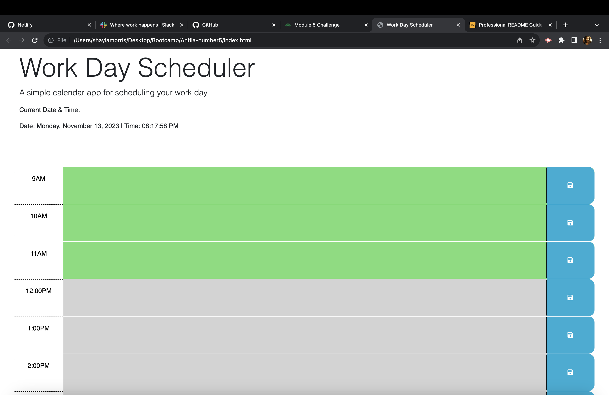

# Work Day Scheduler Starter Code
Module 5 Challenge

Have you ever been on the job and felt like your day was a blur?
Well this application can help clarify your daily tasks.
This work day scheduler helps you get more organized my keeping up with your 
work tasks hour by hour. Just fill in your daily plans and leave the schedule to us.

## Installation

To use the Daily Work planner click on the URL and navigate to the scheduler. 
Scheduler shows workday hours of 9am to 5pm. 
Select block of time and input activitiy for the block. Save inputed data by clicking 'lock' icon on the far right of the block.
past hours will be greyed out.
current time will be indicitive with a red highlight.
future time for that day will be indicitive with a green highlight. 
Current time shows at the top left of the page. 

Thank you 

https://github.com/Iamshaylajade/Antlia-number5
Iamshaylajade.github.io/Antlia-number5

## Usage

## Credits

List your collaborators, if any, with links to their GitHub profiles.

The starter code for this project was provided by:
https://github.com/coding-boot-camp/crispy-octo-meme

Also with the assistance of an ABC learning assistant "Shane" I was able to overide code and clone the repository (I was getting error messages).

If you followed tutorials, include links to those here as well.

https://www.youtube.com/watch?v=0ik6X4DJKCc JavaScript and DOM 
https://www.youtube.com/watch?v=CnozSz4wbBQ JavaScript dates for beginners
https://www.youtube.com/watch?v=YPU6gOctNvM Workday planner

